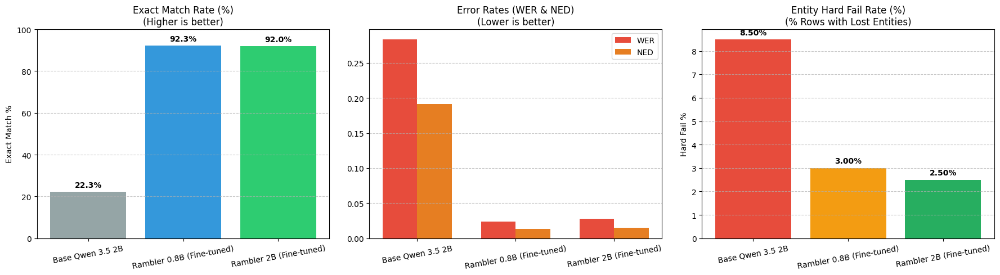
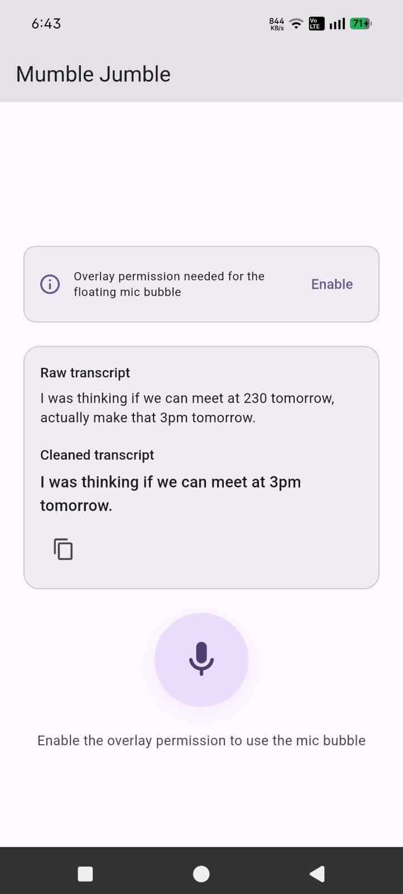

<div align="center">
  <h1>Mumble (de)Jumble 🎙️</h1>

  <p><b>An on-device, privacy-first speech dictation engine that transforms rambling voice notes into polished text.</b></p>

  <a href="https://flutter.dev/"></a>
  <a href="https://github.com/ggerganov/whisper.cpp"></a>
  <a href="https://github.com/ggerganov/llama.cpp"></a>
  <a href="https://huggingface.co/Qwen"></a>
</div>

<br>

## 🗣️ About The Project

**Mumble (de)Jumble** is an offline, edge-AI dictation pipeline designed to eliminate the friction of conversational voice transcription.

Traditional speech-to-text engines produce verbatim transcriptions cluttered with hesitations, mid-sentence corrections, and stuttered phrasing. Inspired by Google Rambler, Mumble Jumble couples local acoustic models with task-adapted small language models (SLMs) to understand speaker intent directly on-device. Everything runs strictly in hardware memory without external API dependencies, ensuring zero network latency and complete user privacy.

```text
"Um, hey Sarah, can you re-reschedule our sync to Thursday, no wait, Friday at 3:30 PM."
                                        ↓
"Hey Sarah, can you reschedule our sync to Friday at 3:30 PM."
```

## ✨ Key Features

* **🛡️ 100% Offline & Private:** Audio capture, ASR transcription, and neural cleanup run locally with zero network calls.
* **✂️ Contextual Disfluency Pruning:** Detects and prunes conversational fillers (*um, uh, you know, basically*) and eliminates syllable and word repetitions (*the- the*, *re-reschedule*).
* **🔄 Mid-Sentence Repair Resolution:** Accurately reconstructs user intent across verbal corrections (*"to Thursday, no wait, Friday"* → *"to Friday"*).
* **🔒 Strict Entity Guardrails:** Fine-tuned to guarantee that critical factual data — including dates, timestamps, proper names, currency, and numerical entities — are never dropped or hallucinated.
* **⚡ Graceful Fallback Engine:** Features an embedded, rule-based `LocalTextProcessor` to sanitize transcripts if on-device model weights are missing or low memory limits are reached.

---

## 🏗️ How It Works

Mumble Jumble operates as an optimized, two-stage edge pipeline:

```text
Mic Audio (16 kHz Mono WAV)
  └──> [Stage 1: ASR]      whisper.cpp tiny.en (~40 MB)
         │                    ↳ Raw, lowercase transcript with spotty punctuation
         └──> [Stage 2: SLM]  Fine-Tuned Qwen3.5-2B (Q4_K_M GGUF, ~1.2 GB)
                                ↳ Clean, structured, grammatically correct text
```

| Pipeline Step | Technology | Role & Constraints |
| --- | --- | --- |
| **Audio Capture** | `record` package | 16 kHz mono WAV with hardware AEC and noise suppression |
| **Acoustic ASR** | `whisper_flutter_new` (`whisper.cpp`) | Bundled `ggml-tiny.en.bin` asset for real-time speech tokenization |
| **Text Cleanup** | Fine-tuned Qwen3.5-2B via `llamadart` | Q4_K_M GGUF at `n_ctx=1024`, greedy decoding, exact training-time prompt |
| **Safe Fallback** | `LocalTextProcessor` | Heuristic engine ensuring zero dropped words during LLM initialization |

---

## 📊 Empirical Benchmarks

Trained with QLoRA across an audited synthetic disfluency dataset, our fine-tuned checkpoints establish production-grade accuracy on speech cleanup tasks:

| Model Variant | Exact Match (EM) | Word Error Rate (WER) | Edit Distance (NED) | Entity Hard Fail Rate | Footprint (Q4_K_M) |
| --- | --- | --- | --- | --- | --- |
| Base Qwen3.5-2B (zero-shot) | 22.33% | 0.2837 | 0.1912 | 8.50% | ~1.2 GB |
| Rambler 0.8B (fine-tuned) | **92.33%** | **0.0241** | **0.0130** | 3.00% | ~505 MB |
| Rambler 2B (fine-tuned) | 92.00% | 0.0277 | 0.0148 | **2.50%** | ~1.2 GB |

> **Evaluation Insight:** Parameter scaling to 2B provides a critical safety buffer, yielding an optimal **2.5% entity hard-fail rate** on high-entropy repairs while remaining constrained to a compact mobile memory ceiling.

### Benchmark Visualization



The chart compares the base Qwen3.5-2B model with both fine-tuned Rambler checkpoints on 300 held-out test examples from the training pipeline. The fine-tuned models raise exact-match accuracy from **22.3%** to approximately **92%**, while reducing both word error rate (WER) and normalized edit distance (NED). The entity hard-fail panel shows the percentage of rows where a declared name, date, time, or number was lost; Rambler 2B has the lowest rate at **2.5%**.

## 📱 App Preview



The Android client displays the raw speech transcript alongside the cleaned result. Processing is designed to stay on-device, with the floating microphone bubble available after overlay permission is enabled.

---

## 🛠️ The Tech Stack

* **Application Core:** Flutter & Dart (cross-platform client and reactive state management)
* **On-Device Inference:** [`llamadart`](https://pub.dev/packages/llamadart) — pure Dart bindings over `llama.cpp` v0.4.0 (no local C++ toolchain required)
* **Acoustic Transcription:** `whisper.cpp` (embedded quantized Whisper architecture)
* **Model Training & Adaptation:** Hugging Face `peft`, `trl`, BitsAndBytes (4-bit QLoRA, r=16)

---

## 📂 Repository Layout

```text
mumble_jumble/
├── lib/                        # Flutter app source
│   ├── controllers/            # VoiceController: record → transcribe → clean
│   ├── models/                 # Application state and transcript entities
│   ├── screens/                # UI screens and dictation interaction views
│   └── services/               # Audio, ASR, LLM runtime, and heuristic fallback
├── assets/models/              # Bundled GGML and GGUF quantization weights
├── Model Training Pipeline Final/  # Colab fine-tuning, adapter merging, GGUF export
├── rambler-compiler/           # Standalone dataset/training/eval pipeline (has its own README)
├── data_pipeline/              # Dataset audits, split validation, and entity tests
├── tools/                      # GGUF utilities (stripping NextN/MTP draft blocks)
└── plan.md                     # Engineering architecture and memory allocation plan
```

---

## 🚀 Getting Started

### Prerequisites

* [Flutter SDK](https://docs.flutter.dev/get-started/install) (Dart `^3.13.1`)
* Android Studio and Android NDK (for native C++ runtime compilation)

### Setup & Installation

**1. Clone the repository:**

```bash
git clone https://github.com/AjaxxIsHere/mumble_jumble.git
cd mumble_jumble
```

**2. Fetch dependencies:**

```bash
flutter pub get
```

**3. Model weights provisioning:**

* [Download the model weights from Google Drive](https://drive.google.com/drive/folders/1pKWz-SyVWkYlUtXFG16gcjHpUJFrtWWp?usp=sharing) if they are not already present in `assets/models/`.
* The Whisper ASR model (`ggml-tiny.en.bin`) and the fine-tuned cleanup model (`rambler-2b-q4_k_m-no-mtp.gguf`, ~1.2 GB) are both bundled in `assets/models/`.
* On first Android launch, the GGUF is streamed out of the APK into app storage (chunked copy — it is never buffered whole in memory).
* Desktop builds look for the GGUF in the platform support directory if the asset is unavailable.
* *If the cleanup model can't be loaded, the app automatically falls back to the rule-based `LocalTextProcessor` — cleanup never fails silently, and user text is never lost.*

**4. Build and run:**

```bash
flutter run
```

---

## 📱 Platform Support

| Platform | Support Tier | Hardware Execution |
| --- | --- | --- |
| **Android** | ✅ Primary | Supported on ARM64 devices (6 GB+ RAM recommended for 2B engine) |
| **iOS / macOS** | ⚠️ Buildable | Compatible via Metal llama.cpp runtime (currently untested) |
| **Web** | ❌ Unsupported | Restricted due to raw WAV audio recording and local multithread constraints |

---

## 🗺️ Roadmap

* [x] **Phase 1: Corpus Creation** — Audited synthetic multi-bucket disfluency training splits.
* [x] **Phase 2: Fine-Tuning** — QLoRA adaptation of Qwen3.5 on T4 GPU environments.
* [x] **Phase 3: Quantization** — Verified 4-bit GGUF generation stripped of MTP draft layers.
* [ ] **Phase 4: Engine Integration** — Full deployment of fine-tuned GGUF into mobile `llama.cpp` bindings.
* [ ] **Phase 5: Spoken Macro Parsing** — Native voice punctuation replacement (*"period"*, *"comma"*, *"new paragraph"*).
